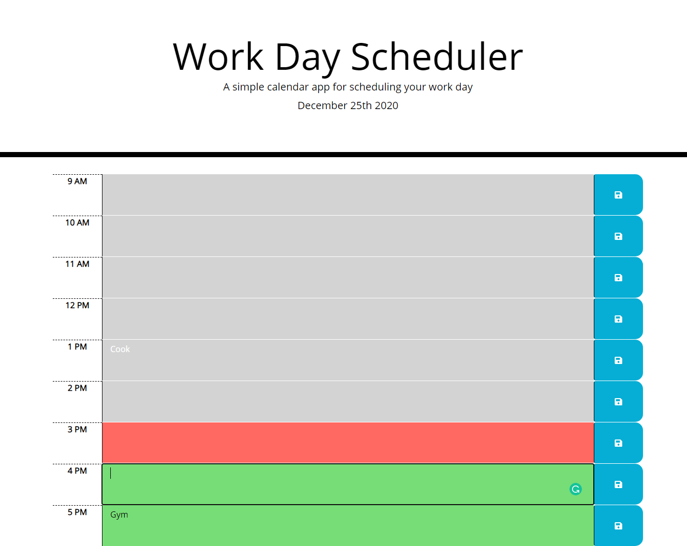

# Work Day Scheduler

## Task

Create a simple calendar application that allows a user to save events for each hour of the day. This app will run in the browser and feature dynamically updated HTML and CSS powered by jQuery.


## User Story

```
AS AN employee with a busy schedule
I WANT to add important events to a daily planner
SO THAT I can manage my time effectively
```
### Built With
----
```
  * HTML
  * Custom CSS
  * Javascript
  * Bootstrap
  * Moment.js
```    

### How to Use
----
```
  1- Page will load all the todos of the day you have previously saved.
  2- You can edit or put new content in the textare then use save button in the right
  3- The hour row will change color if the activity 
        * Past due for Gray.
        * Red for actual present hour.
        * Green for future time.
```    
### Submission
---

Github Repo URL: 
[https://github.com/v1zconde/day_Planner](https://github.com/v1zconde/day_Planner)

Deployed URL: [https://v1zconde.github.io/day_Planner/](https://v1zconde.github.io/day_Planner/)

## Website
---
### Home Page

